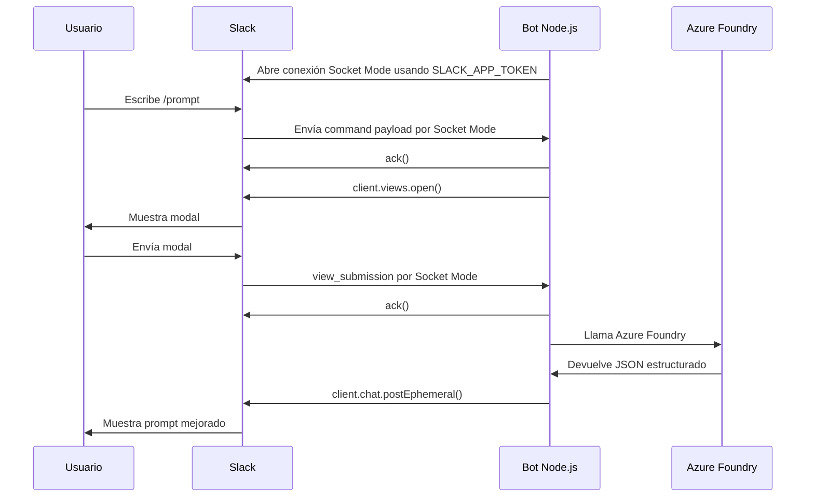

# Arquitectura y archivos JavaScript

Este documento explica cómo funciona **Slack Prompt Coach** por dentro y qué responsabilidad tiene cada archivo JavaScript del proyecto.

## Resumen del modelo

Slack Prompt Coach es un bot de Slack en **Node.js + JavaScript** que corre con **Slack Bolt en Socket Mode**. No expone un endpoint HTTP público para eventos de Slack.

Flujo principal:

```text
Slack /prompt o message shortcut
  ↓
Slack Bolt Socket Mode
  ↓
Modal de Slack
  ↓
Prompt Coach interno
  ↓
Azure Foundry Responses API con JSON schema
  ↓
Respuesta Slack con Block Kit + fallback text
  ↓
Botones de refinamiento / selector de variantes
```

El bot no usa base de datos en V1. Para botones de refinamiento, la fuente primaria de contexto es el payload de Slack (`message.blocks` o `message.text`). Solo usa cache temporal en memoria como fallback cuando Slack no entrega contexto suficiente.

### Flujo de comunicación Slack → bot → Azure Foundry



Punto clave: Slack envía eventos al bot por la conexión de Socket Mode, pero las respuestas del bot se envían usando Slack Web API con `SLACK_BOT_TOKEN`.

---

## Archivos de entrada y arranque

### `src/index.js`

Punto de entrada de la aplicación.

Responsabilidades:

- Cargar variables desde `.env` usando `dotenv`.
- Validar configuración con `loadEnv()`.
- Crear el generador de texto de Azure Foundry.
- Crear el `promptCoach`.
- Crear la app de Slack Bolt con Socket Mode.
- Registrar handlers de Slack:
  - `/prompt`
  - message shortcut
  - modal submissions
  - botones/selects interactivos
- Iniciar el bot.

Este archivo debe mantenerse delgado. No debe contener lógica de prompt, lógica de Slack Block Kit ni reglas del modelo.

---

## Capa Slack

### `src/slack/commands.js`

Registra el slash command `/prompt`.

Responsabilidades:

- Hacer `ack()` inmediatamente cuando Slack envía el comando.
- Abrir el modal principal con `client.views.open()`.
- Pasar `channelId` y `userId` al modal usando `private_metadata`.

No debe llamar OpenAI ni procesar prompts.

---

### `src/slack/modals.js`

Construye y lee modales de Slack.

Responsabilidades:

- Construir el modal principal de Prompt Coach.
- Construir modal de casos de uso.
- Construir modal de ejemplos.
- Definir `callback_id`, `block_id` y `action_id` estables.
- Extraer el formulario enviado por Slack con `extractPromptSubmission()`.

Campos del modal principal:

1. Herramienta destino.
2. Prompt o idea inicial.

Herramientas disponibles:

- ChatGPT
- Codex
- Cursor
- GitHub Copilot
- Claude Code
- Otra

Reglas importantes:

- Los placeholders de Slack deben mantenerse cortos.
- El texto prellenado desde shortcut se recorta a 3000 caracteres.
- No agregar campos nuevos sin justificar el impacto de UX y tests.

---

### `src/slack/views.js`

Registra los handlers principales de interacción Slack.

Responsabilidades:

- Manejar submission del modal principal.
- Manejar botones de guía y ejemplos.
- Manejar botones de refinamiento.
- Manejar selector de variantes.
- Enviar respuestas privadas al usuario.
- Enviar mensajes de error privados cuando falta contexto.
- Hacer `ack()` en todos los handlers interactivos.

Flujos que maneja:

- `app.view(PROMPT_MODAL_CALLBACK_ID)` → genera prompt inicial.
- `app.action(prompt_refine_*)` → genera una versión refinada.
- `app.action(PROMPT_VARIANT_ACTION_ID)` → genera una variante.
- `app.action(PROMPT_GUIDE_ACTION_ID)` → abre guía.
- `app.action(PROMPT_EXAMPLES_ACTION_ID)` → abre ejemplos.

Detalle importante:

Cuando el usuario presiona un botón, Slack no muestra automáticamente que el bot está trabajando. Por eso `views.js` manda primero un mensaje privado tipo “Estoy generando...” antes de llamar a OpenAI.

---

### `src/slack/responseBlocks.js`

Construye los bloques visuales de Slack y contiene las instrucciones de botones/variantes.

Responsabilidades:

- Convertir la respuesta del coach en Block Kit.
- Mantener fallback compatible con Slack.
- Dividir prompts largos en chunks para no romper límites de Slack.
- Renderizar:
  - herramienta destino
  - problemas detectados
  - prompt mejorado
  - contexto por aclarar
  - checklist
  - estrategia aplicada
  - botones de refinamiento
  - selector de variantes
- Extraer de vuelta el prompt desde `message.blocks` o `message.text`.
- Insertar un ID temporal de contexto en `block_id` como fallback para los botones, no como fuente primaria.

Botones actuales:

- Más corto
- Más completo
- Agregar restricciones
- Agregar pruebas
- Criterios de aceptación

Variantes actuales:

- Versión corta
- Versión completa
- Versión agentic
- Adaptar a Codex
- Adaptar a ChatGPT
- Adaptar a Cursor
- Adaptar a Copilot
- Adaptar a Claude Code

No renderiza:

- Botones `Útil` / `No útil`.
- Score visible `Calidad del prompt original`.

---

### `src/slack/promptContextCache.js`

Cache temporal en memoria usado solo como fallback para contexto de botones.

Responsabilidades:

- Guardar temporalmente:
  - herramienta destino
  - prompt actual generado
- Devolver contexto solo cuando el payload de Slack no trae `message.blocks` ni `message.text` suficiente.
- Expirar entradas automáticamente.

TTL actual:

```text
15 minutos
```

Limitaciones:

- No es base de datos.
- Se pierde al reiniciar el proceso.
- No sirve para analytics.
- No debe usarse para historial permanente.

Este cache existe solo para cubrir el caso fallback donde Slack no entregue el mensaje/contexto suficiente en la interacción. No debe reemplazar la recuperación desde el mensaje de Slack y no justifica agregar DB en V1.

---

### `src/slack/shortcuts.js`

Registra el message shortcut de Slack.

Callback ID:

```text
prompt_coach_message_shortcut
```

Responsabilidades:

- Hacer `ack()` al recibir el shortcut.
- Tomar el texto del mensaje seleccionado.
- Recortarlo a 3000 caracteres.
- Abrir el modal principal con ese texto prellenado.

Esto permite usar “Mejorar este prompt” sobre un mensaje existente de Slack.

---

## Capa Prompt Coach

### `src/prompt/promptCoach.js`

Contiene la lógica de negocio entre Slack y OpenAI.

Responsabilidades:

- Leer `system-prompt.md`.
- Construir el input para OpenAI.
- Ejecutar generación inicial, refinamientos y variantes.
- Parsear JSON de salida del modelo.
- Normalizar listas a máximo 3 elementos.
- Normalizar score interno entre 0 y 100.
- Eliminar claims prohibidos como:
  - “revisé el repo”
  - “analicé archivos”
  - “ejecuté tests”
  - “accedí al PR”
- Crear fallback de texto plano para Slack.

Métodos principales:

```js
coach.generate(form)
coach.refine({ tool, currentPrompt, refinement })
coach.variant({ tool, currentPrompt, variant, variantInstruction })
```

Este archivo no debe saber detalles de Slack Bolt ni de la API concreta de OpenAI.

---

### `src/prompt/system-prompt.md`

Prompt de sistema usado por OpenAI.

Responsabilidades:

- Definir el rol del bot.
- Definir el contrato de entrada.
- Definir qué debe producir.
- Definir guardrails de seguridad.
- Prohibir afirmaciones falsas sobre repositorios, archivos, PRs o ejecución.
- Definir rúbrica interna de calidad.
- Definir JSON obligatorio de salida.

Este archivo es crítico. Cambiarlo puede alterar fuertemente la calidad del bot aunque no cambie código JavaScript.

---

## Capa Azure Foundry

### `src/llm/azureOpenAIClient.js`

Adaptador entre la app y Azure Foundry.

Responsabilidades:

- Crear el cliente del SDK OpenAI configurado contra Azure Foundry.
- Construir requests para Responses API.
- Forzar salida con JSON schema estricto.
- Configurar:
  - modelo
  - reasoning effort
  - límite de tokens
  - instrucciones
  - input

Schema esperado:

```js
{
  improvedPrompt: string,
  questions: string[],
  checklist: string[],
  strategy: string,
  qualityScore: number,
  detectedIssues: string[],
  recommendedActions: string[]
}
```

Nota: `qualityScore` se mantiene internamente, pero no se muestra al usuario en Slack.

---

## Utilidades

### `src/utils/env.js`

Responsabilidades:

- Validar variables obligatorias.
- Definir defaults seguros para desarrollo.
- Convertir `PORT` a número.

Variables obligatorias:

- `SLACK_BOT_TOKEN`
- `SLACK_APP_TOKEN`
- `SLACK_SIGNING_SECRET`
- `AZURE_OPENAI_API_KEY`
- `AZURE_OPENAI_ENDPOINT`
- `AZURE_OPENAI_MODEL`

---

### `src/utils/logger.js`

Logger simple con niveles:

- debug
- info
- warn
- error

Responsabilidades:

- Respetar `LOG_LEVEL`.
- Filtrar metadata cuyo nombre parezca secreto:
  - token
  - secret
  - key

No debe loggear prompts completos, tokens ni API keys.

---

## Archivos de configuración necesarios

### `.env.example`

Plantilla de variables de entorno. Debe versionarse.

### `.env`

Archivo local/servidor con secretos reales. No debe versionarse.

### `.gitignore`

Debe excluir:

- `node_modules/`
- `.env`
- `.env.*`, excepto `.env.example`
- `logs/`
- `*.log`
- `.DS_Store`
- archivos locales de acceso o notas sensibles

### `package.json`

Define scripts y dependencias.

Scripts importantes:

```bash
npm start
npm test
npm run check
```

### `ecosystem.config.js`

Configuración PM2 para correr el bot en Hostinger o Linux.

---

## Tests

Los tests viven en `test/`.

Cobertura principal:

- validación de env
- construcción de modales
- extracción del formulario
- schema OpenAI
- prompt coach
- Block Kit
- extracción de contexto desde mensajes Slack
- interacciones de botones/selects
- message shortcut

Comando recomendado antes de subir cambios:

```bash
npm run check
```

---

## Reglas de mantenimiento

- No meter DB en V1.
- No agregar GitHub API, Jira, RAG, dashboard ni App Home.
- No guardar prompts completos.
- No loggear secretos.
- No agregar TypeScript en este MVP.
- No cambiar `action_id` o `callback_id` sin actualizar tests y configuración Slack.
- No refactorizar por gusto.
- Todo cambio funcional debe tener test.
